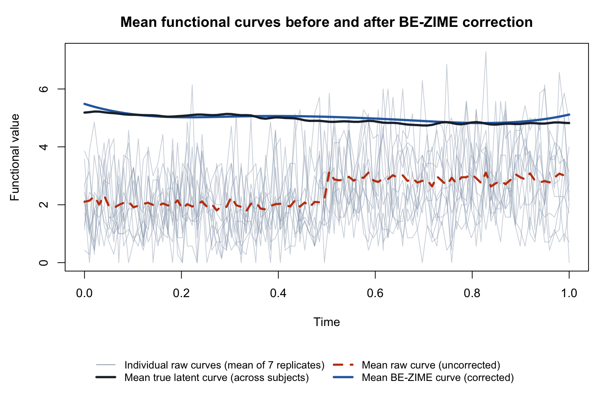

# Correcting Measurement Error and Zero Inflation in Functional Covariates for Scalar-on-Function Quantile Regression

Welcome! This repository is the code companion for our paper **"Correcting Measurement Error and Zero Inflation in Functional Covariates for Scalar-on-Function Quantile Regression"**, by Caihong Qin, Lan Xue, Ufuk Beyaztas, Roger S. Zoh, Mark Benden, Jeff Goldsmith, and Carmen D. Tekwe.

The paper was published in *Statistics in Medicine*, 45(10--12):e70598, 2026. The DOI is: https://doi.org/10.1002/sim.70598.

The paper studies functional covariates observed through repeated measurements that contain both measurement error and excess zeros. The code here focuses on the proposed BE-ZIME correction, which estimates the zero-inflation probabilities and recovers the latent functional curves.

## Example

The example below generates sample data, applies the proposed BE-ZIME correction, and assesses recovery of the latent curves and zero-inflation probabilities.

Install the required packages once before running the example:

```r
install.packages(c("MASS", "lme4"))
```

```r
source("zime_functions.R")

# Generate latent curves, zero-inflated repeated measurements, and a response.
sample_data <- generate_zime_sample(
  n = 100,                  # sample size
  grid_length = 100,        # number of observed time points
  n_replicates = 7,         # number of repeated measurements per subject
  n_segments = 2,           # number of zero-inflation intervals
  first_segment_prob = 0.4, # nonzero probability in the first segment
  pattern = "alternating",  # piecewise pattern for nonzero probabilities
  seed = 2026               # random seed for reproducibility
)

# w is a 100 x 100 x 7 array: subjects x time points x replicates.
# x is a 100 x 100 matrix containing the true latent curves.
# zero_inflation is a 100 x 2 matrix of subject-interval probabilities.

# Apply BE-ZIME to recover latent curves and zero-inflation probabilities.
zime_fit <- estimate_be_zime(
  w = sample_data$w,              # observed zero-inflated replicated measurements
  grid = sample_data$grid,        # observation grid
  basis_df = 6,                   # number of full B-spline basis functions
  basis_degree = 3,               # cubic B-spline basis
  n_segments = 2                  # working number of zero-inflation intervals
)

zime_fit$converged
zime_fit$iterations

# Summarize correction accuracy in the generated example.
zero_inflation_mse <- mean((zime_fit$zero_inflation_hat - sample_data$zero_inflation)^2)
x_mse <- mean((zime_fit$x_hat - sample_data$x)^2)

zero_inflation_mse
x_mse

# Average the raw replicates within subjects and compare overall mean curves.
raw_subject_curves <- apply(sample_data$w, c(1, 2), mean)
raw_mean <- colMeans(raw_subject_curves)
estimated_mean <- colMeans(zime_fit$x_hat)
true_mean <- colMeans(sample_data$x)
subjects <- 1:12

png("zime_mean_curves.png", width = 1500, height = 1000, res = 180)
par(mar = c(9, 4.5, 3, 1))
matplot(
  sample_data$grid, t(raw_subject_curves[subjects, ]),
  type = "l", lty = 1,
  col = adjustcolor("#94A3B8", alpha.f = 0.45),
  xlab = "Time", ylab = "Functional value",
  main = "Mean functional curves before and after BE-ZIME correction"
)
lines(sample_data$grid, raw_mean, col = "#C2410C", lwd = 2.8, lty = 2)
lines(sample_data$grid, estimated_mean, col = "#2B6CB0", lwd = 3)
lines(sample_data$grid, true_mean, col = "#1F2937", lwd = 3)
legend(
  "bottom",
  legend = c(
    "Individual raw curves (mean of 7 replicates)",
    "Mean true latent curve (across subjects)",
    "Mean raw curve (uncorrected)",
    "Mean BE-ZIME curve (corrected)"
  ),
  col = c("#94A3B8", "#1F2937", "#C2410C", "#2B6CB0"),
  lty = c(1, 1, 2, 1), lwd = c(1, 3, 2.8, 3),
  bty = "n", ncol = 2, cex = 0.86,
  inset = c(0, -0.52), xpd = TRUE
)
dev.off()
```

Running the correction gives:

```text
converged: TRUE
iterations: 1
zero-inflation MSE: 0.000889723
latent-curve MSE: 0.5217505
```

The zero-inflation MSE compares the estimated and true zero-inflation probabilities, while the latent-curve MSE averages the squared pointwise differences between the recovered and true curves. In this example, BE-ZIME converges in one iteration, estimates the zero-inflation probabilities closely, and recovers the broad subject-specific levels and trends despite the noisy zero-inflated replicates.



The gray lines are the raw curves for 12 subjects after averaging their seven replicates. The dashed red line is the uncorrected mean raw curve, the blue line is the mean corrected curve from BE-ZIME, and the black line is the mean true latent curve across all subjects. The raw mean is shifted downward by the excess zeros, while the corrected mean closely follows the true mean.

To use your own data, prepare `w` as an array with dimensions `n_subjects x n_grid_points x n_replicates`. The entries should be nonnegative measurements of the same underlying functional covariate. Choose `n_segments` as the working number of piecewise-constant zero-inflation intervals. The true and estimated nonzero probabilities are returned as `n_subjects x n_segments` matrices.

## Details

The repository includes:

- `zime_functions.R`: sample data generation and BE-ZIME correction.
- `zime_mean_curves.png`: the raw, estimated, and true mean curves from the example.

Required R packages:

- `MASS`, `splines`, and `lme4` for the BE-ZIME correction.

Main functions:

- `generate_zime_sample()`: generates latent curves and zero-inflated replicated measurements.
- `estimate_be_zime()`: builds the B-spline basis and corrects both zero inflation and measurement error.
- `fit_joint_quantile_regression()`: fits the second-stage joint quantile regression with `quantregGrowth::gcrq`.
